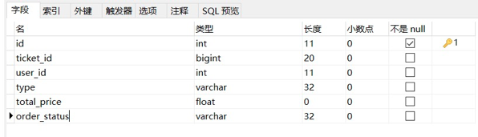
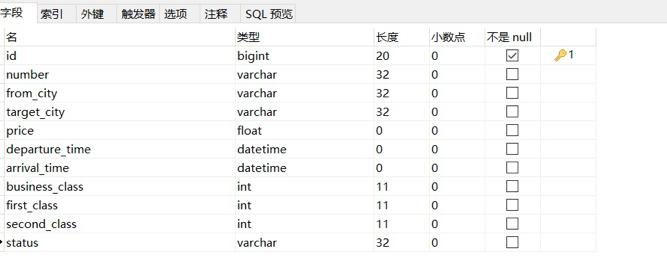
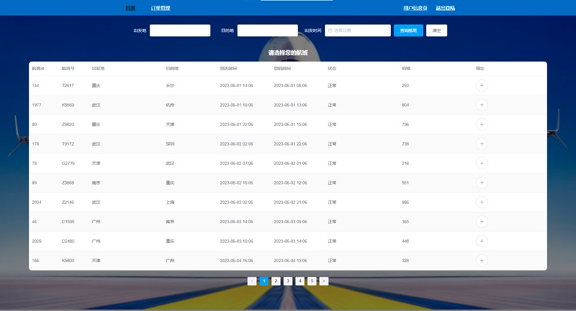
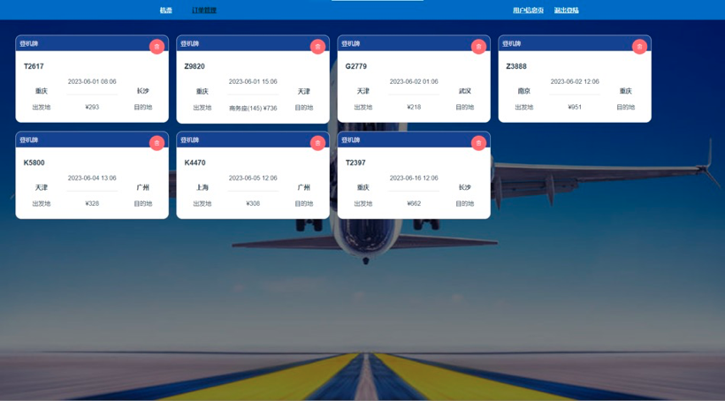
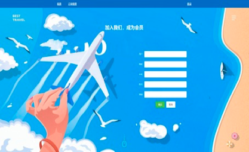

# **机票预定**系统项目介绍

**本项目基于 Spring boot + vue 开发，使用 Spring Security 实现登陆和鉴权，MySQL 存储数据，redis 作为缓存和分布式锁。**

后端代码：https://github.com/ChenZixinn/TicketReservationSystem

### 1、开发环境

开发工具：Intellij IDEA，Visual Studio Code

运行环境：JDK8

主要组件： **Redis、SpringBoot、vue、MySQL、Spring Security、Redisson**

### 2、数据表

##### 用户表（user）



##### 机票表 （ticket）



##### 订单表（order_ticket）


### 3、界面展示

##### 机票预订页

##### 

##### 订单管理页



##### **登录注册页**




### 4、运行

##### Project setup

```
npm install
```

##### Compiles and hot-reloads for development

```
npm run serve
```

##### Compiles and minifies for production

```
npm run build
```

##### Lints and fixes files

```
npm run lint
```

##### Customize configuration

See [Configuration Reference](https://cli.vuejs.org/config/).
